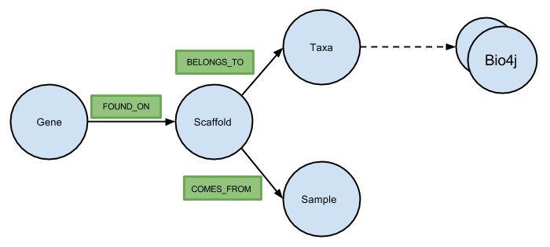

# IMG/M ER Tar balls
This set of scripts load your IMG/M ER annotated data the database.

## What does it do exactly?
* Parses an IMG tar-ball.
* Consolidates data from all files in the tar-ball and creates a single tab-delimited file for all the data that needs to be loaded in the database.
* Creates required constraints and indexes.
* Creates nodes and adds properties from the tab-delimited file into the database.

## Schema
*Place Holder Schema*

## ToDo:
* Add relationships in the database.
* Make this a one step-one script process.
* Add image of the updated schema