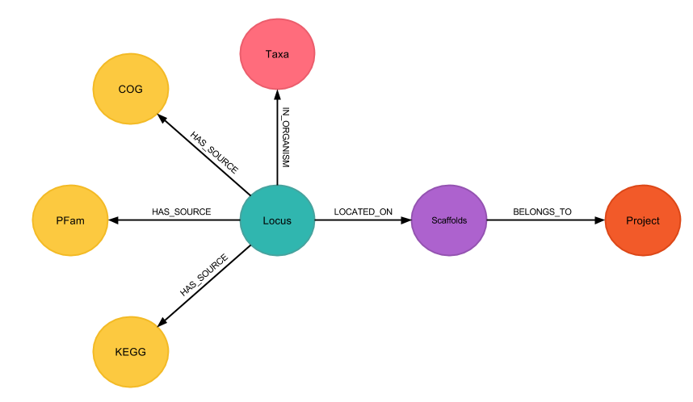
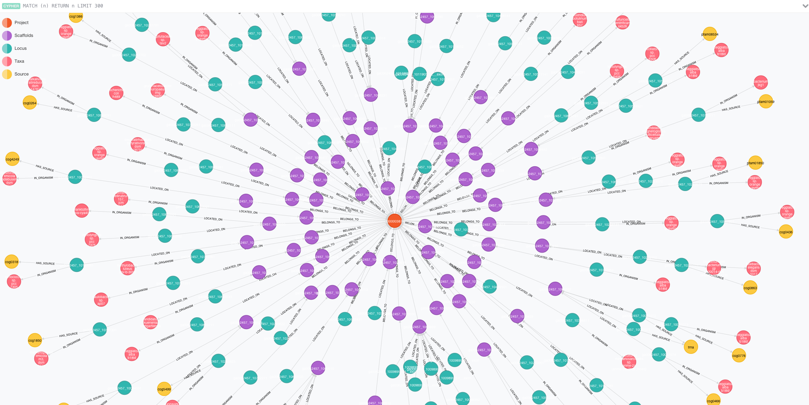

# IMG/M ER Tar balls
This set of scripts load your IMG/M ER annotated data the database.

## What does it do exactly?
* Parses an IMG tar-ball.
* Consolidates data from all files in the tar-ball and creates a single tab-delimited file for all the data that needs to be loaded in the database.
* Creates required constraints and indexes.
* Creates nodes and adds properties from the tab-delimited file into the database.

## Schema
*Place Holder Schema*


## Screen Shot of the current database


## How to use it?
* Reformat the data in a tabular format by executing the `perl` script `createDB.pl`, like so:

```
perl createDB.pl -gff file.gff -phylodist file.phylodist -gene_prod file.geneproducts -map file.map -lgc file.length_gc -out file.output
```

* Edit the `loadData.cql` to point to the output of the previoius step.
* On your terminal, navigate into the neo4j `bin` folder and type:

```
neo4j-shell -file loadData.cql
```

**WARNING:** The steps mentioned above have only been tested on a small sample set. Use these scripts at your own risk.

## ToDo:
* Make this a one step-one script process.
* Add image of the updated schema